[README_TROC.md](https://github.com/user-attachments/files/30098156/README_TROC.md)
# Barterology — Web Bartering Application

A full-stack bartering (troc) web application developed as a final-year project (Projet de Fin d'Études) at **École Supérieure de Technologie d'Oujda** (Mohammed Premier University).

---

## Overview

This project digitises the concept of bartering by providing a structured online platform where users can post offers for goods or services they wish to exchange, browse listings from other users, and negotiate trades through a built-in messaging system. The application supports three distinct user roles, each with a tailored interface and permission set.

---

## Features

### Public (Anonymous Visitor)
- Browse and search all published barter offers by type, category, or keyword
- View offer details including images, descriptions, and exchange requirements
- Contact the administrator via a contact form
- Register for a trader account

### Trader (Troqueur)
- Authenticated account with personal profile management
- Post new barter offers with title, category, type (good/service), image, and description
- Search and filter offers by type, category, or keyword
- Contact other traders directly through the internal messaging system
- Manage personal offers (edit, delete)
- View inbox and sent messages with reply and delete actions

### Administrator
- All trader capabilities
- Full user management — view, edit, and delete registered trader accounts
- Moderate all offers across the platform (view, edit, delete)
- Manage offer categories
- Access and manage all contact messages received from visitors and traders
- Profile management

---

## Technology Stack

| Layer | Technologies |
|---|---|
| Frontend | HTML5, CSS3, JavaScript (ES6), jQuery |
| Backend | PHP (Hypertext Preprocessor) |
| Database | MySQL (via XAMPP/phpMyAdmin) |
| Modelling | PowerDesigner (MCD/MLD), Lucidchart (UML diagrams) |
| Dev Environment | Visual Studio Code, XAMPP (Apache + MySQL) |

---

## Database Design

The MySQL database comprises **6 tables**:

- `personne` — stores account information for both administrators and registered traders
- `profile` — defines user roles (administrator or trader)
- `offre` — stores barter offers posted by traders, including type, category, image, and description
- `categorie` — offer categories used to facilitate search and filtering
- `message_offre` — messages exchanged between traders in response to offers
- `message_admin` — contact messages sent to the administrator by visitors or traders

Relationships were designed using a Conceptual Data Model (MCD) and subsequently translated to a Logical Data Model (MLD) using PowerDesigner.

---

## Project Structure

```
/
├── index.php                  # Main entry point — public-facing homepage
├── personne/                  # PHP backend (authentication, CRUD logic, session management)
│   ├── admin/                 # Administrator dashboard and management pages
│   └── troqueur/              # Trader dashboard and offer management
├── assets/
│   ├── css/                   # Stylesheets and responsive design
│   ├── js/                    # Client-side JavaScript and jQuery logic
│   └── images/                # Offer images, logos, and UI assets
└──                    # Final-year project report, UML diagrams, and data models
```

---

## Installation

### Prerequisites
- [XAMPP](https://www.apachefriends.org/) (Apache + MySQL + PHP 7.4+)
- A modern web browser

### Steps

1. **Clone the repository**
   ```bash
   git clone https://github.com/your-username/barterology.git
   ```

2. **Move to the XAMPP web root**
   ```bash
   mv barterology /path/to/xampp/htdocs/
   ```

3. **Start Apache and MySQL** via the XAMPP Control Panel.

4. **Import the database**
   - Open `http://localhost/phpmyadmin`
   - Create a new database named `barterology`
   - Import the provided `.sql` file from the `/rapport` folder

5. **Configure the database connection**
   - Open `personne/config.php` (or equivalent connection file)
   - Update the host, username, password, and database name to match your local setup

6. **Access the application**
   ```
   http://localhost/barterology/index.php
   ```

### Default Credentials (Development)

| Role | Login | Password |
|---|---|---|
| Administrator | admin | admin |
| Trader | youness | youness |

---

## Screenshots

### Public Homepage
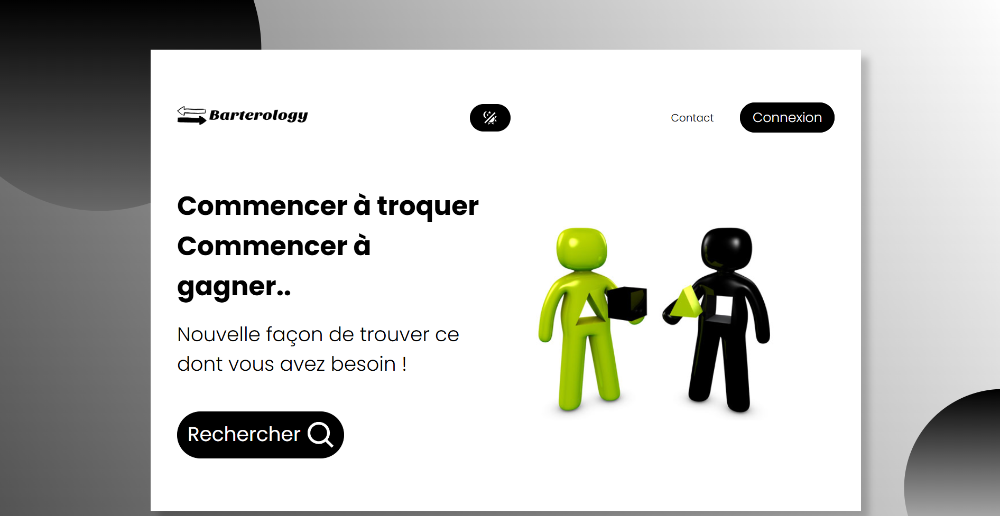
*Landing page with "Commencer à troquer" call to action and search button — Barterology branding*

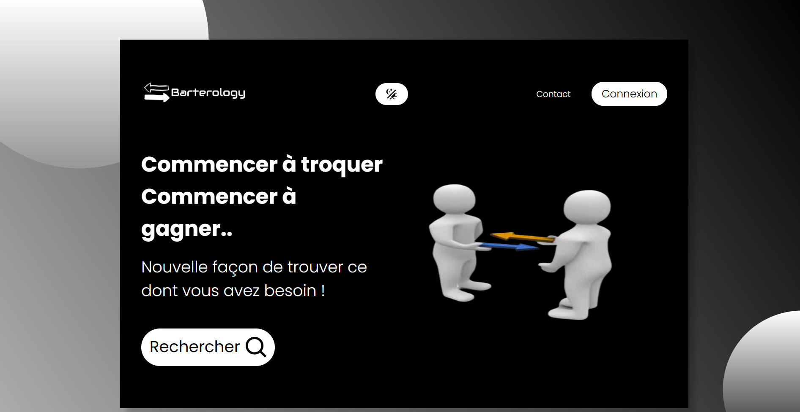
*Landing page dark theme version showcasing Barterology branding, hero section, and navigation elements*


*Explainer section describing how to post and search for barter offers*

### Authentication
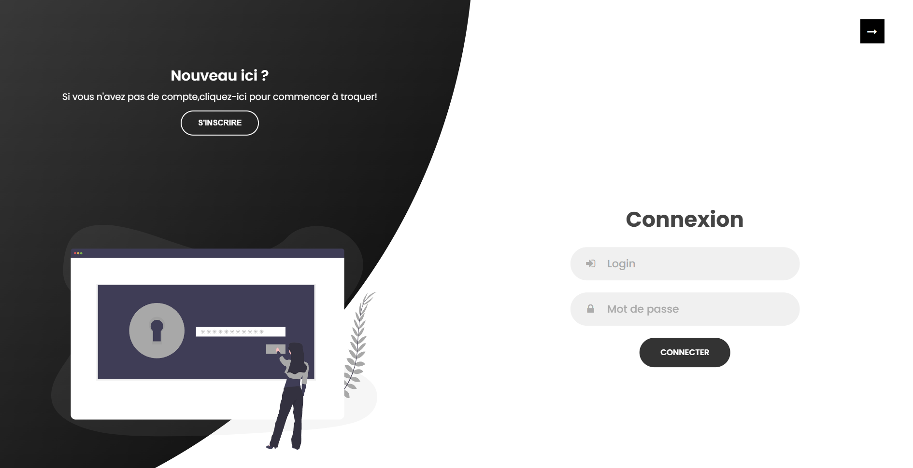
*Split-panel login and registration page with dark theme*

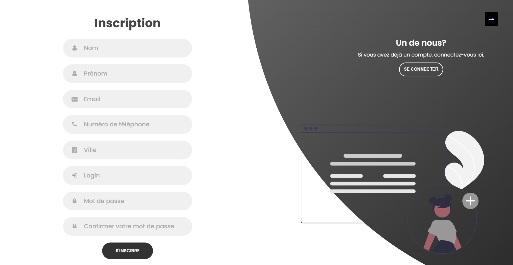
*New trader registration form allowing customers to create an account with personal information and login credentials*

### Offer Search
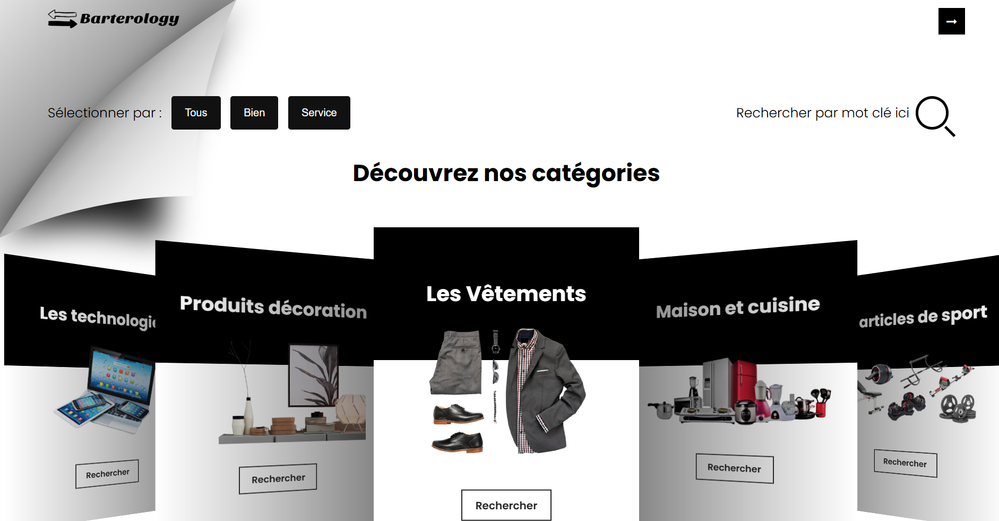
*Browseable offer catalogue with type filter (Tous / Bien / Service), category cards, and keyword search*

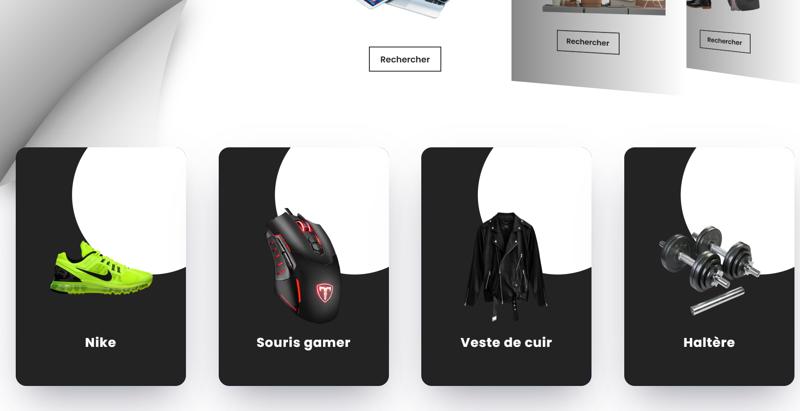
*Offer catalogue displayed in card style with product details revealed on hover and interactive browsing experience*

### Contact Page

*Contact form for anonymous visitors to reach the administrator*

### Administrator Dashboard
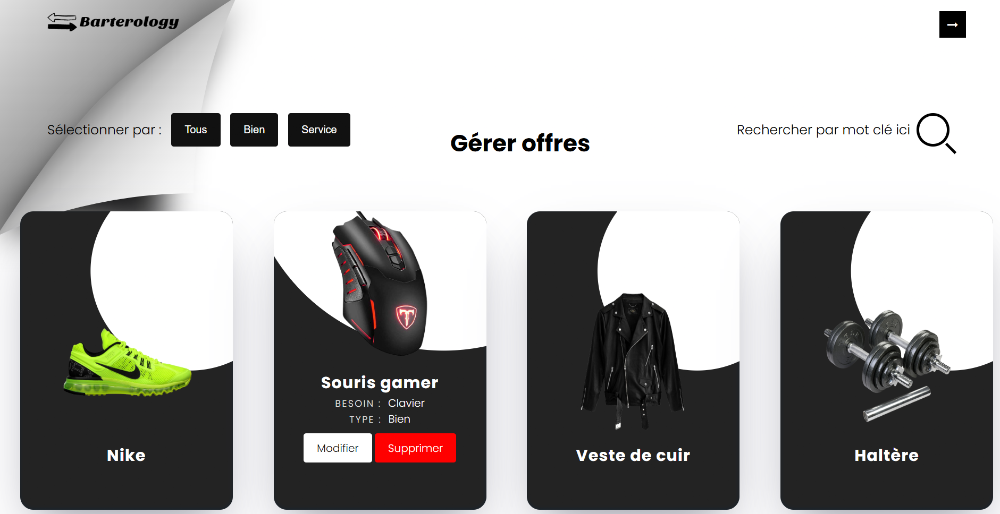
*Admin offer management panel with filter and card grid display*

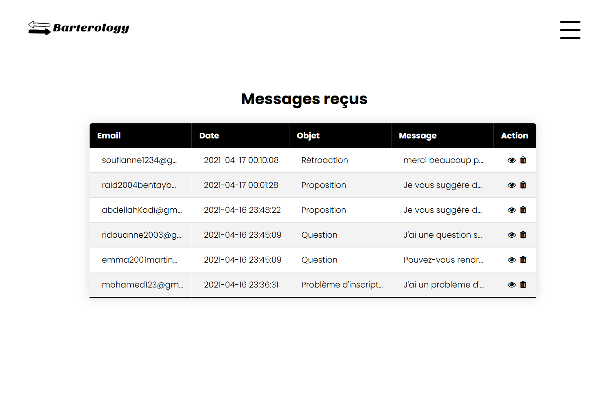
*Inbox table showing email, date, subject, message preview, and action controls*

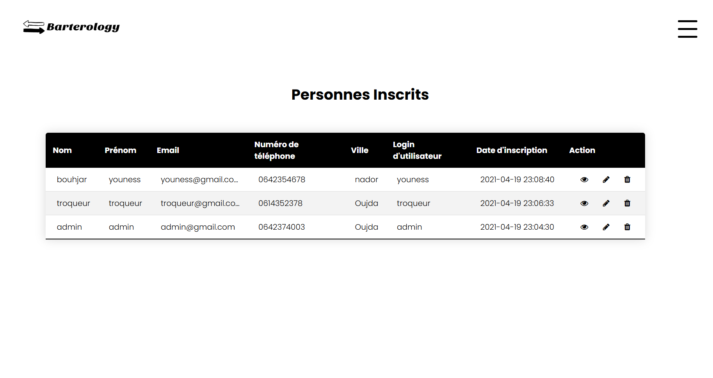
*Registered trader table with name, email, phone, city, login, and CRUD actions*

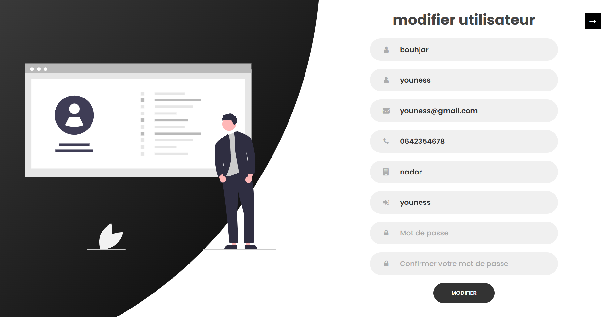
*View and edit individual trader profiles*

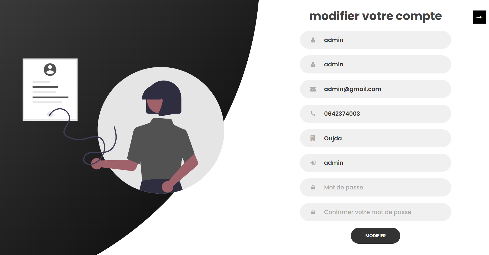
*Administrator account management form*

### Trader Dashboard
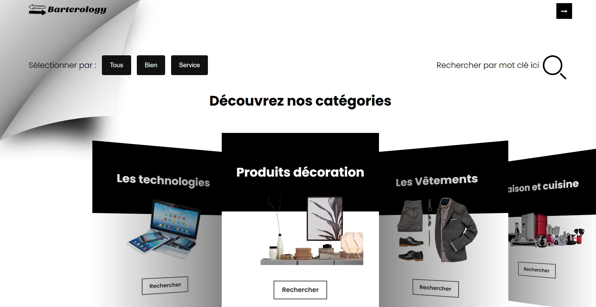
*Trader homepage with offer search section*

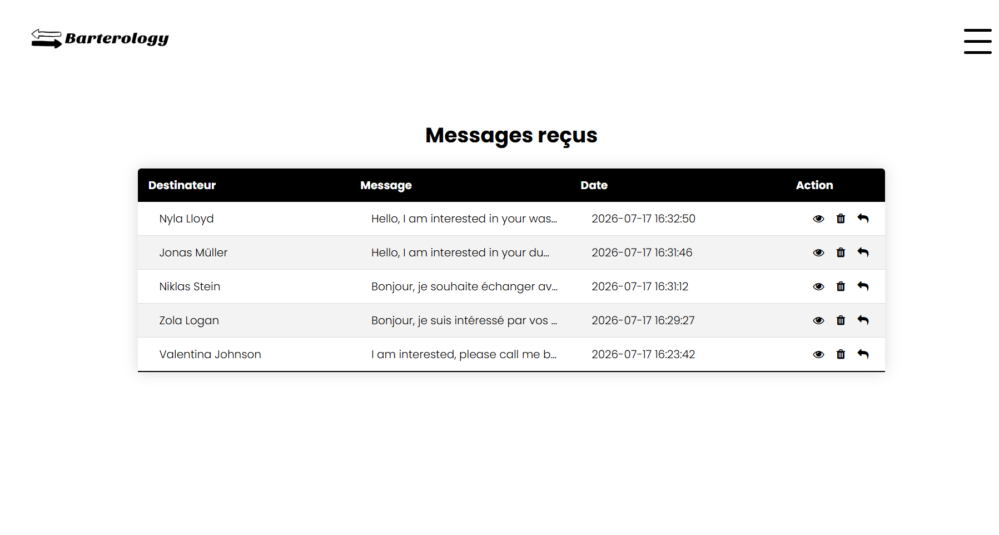
*Trader inbox and sent messages with reply and delete actions*


*Offer submission form with title, type, category, description, image upload, and exchange wish field*

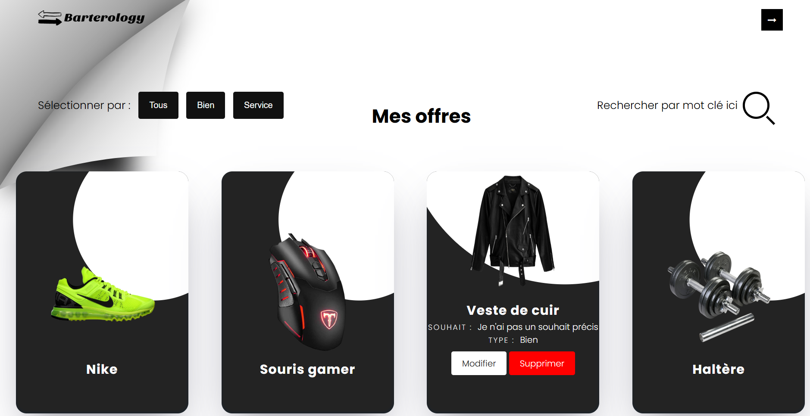
*Personal offer management with edit and delete actions per listing*

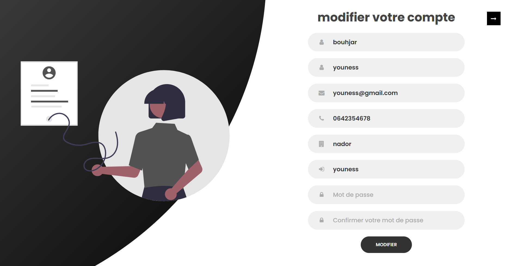
*Trader account management form*

> **Note:** To populate the screenshots above, export the images from the project report and place them in `screenshots/` using the filenames shown.

---

## UML Diagrams

The following UML artefacts were produced during the design phase and are available in the `/rapport` folder:

- **Use Case Diagram** — illustrates interactions between all three actors (anonymous visitor, trader, administrator) and the system
- **Sequence Diagram: Login** — models the authentication flow including success and failure scenarios
- **Sequence Diagram: Post an Offer** — models the offer submission workflow end-to-end
- **Conceptual Data Model (MCD)** — entity-relationship representation of all data entities
- **Logical Data Model (MLD)** — relational schema generated from the MCD via PowerDesigner

---

## Skills Demonstrated

- **Full-stack web development** using PHP, JavaScript, HTML, and CSS without a framework
- **Relational database design** from conceptual modelling through to physical implementation
- **Role-based access control** with session management in PHP
- **UML modelling** (use cases, sequence diagrams, data models)
- **Responsive UI design** supporting light and dark themes
- **Requirements analysis** from a structured project brief (cahier des charges)
- **Feature design for peer-to-peer interaction** — offer posting, search, and direct messaging between users

---

## Context

This application was developed as a **final-year academic project** (Projet de Fin d'Études, academic year 2020–2021) under the supervision of:

- **Academic supervisor:** Prof. Hafida Zrouri — École Supérieure de Technologie d'Oujda

**Programme:** Développeur d'Applications Informatiques  
**Department:** Génie Informatique — École Supérieure de Technologie d'Oujda

---

## Author

**Youness Bouhjar**  
[LinkedIn](https://www.linkedin.com/in/youness-bouhjar-066a92286/) · [GitHub](https://github.com/youness-eng/) · [Email](mailto:youness14bouhjar@gmail.com)
